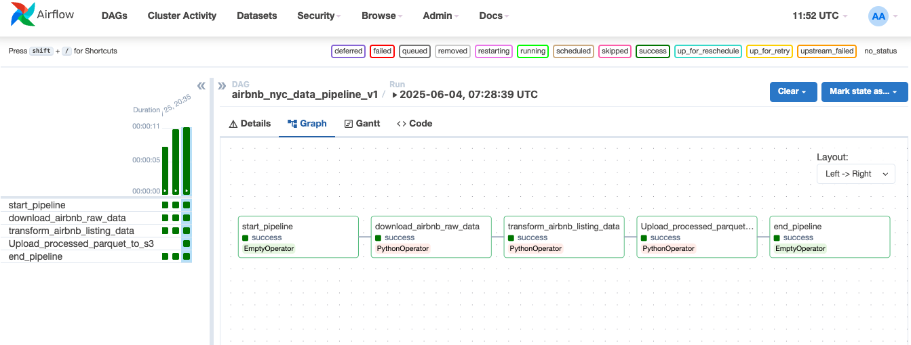
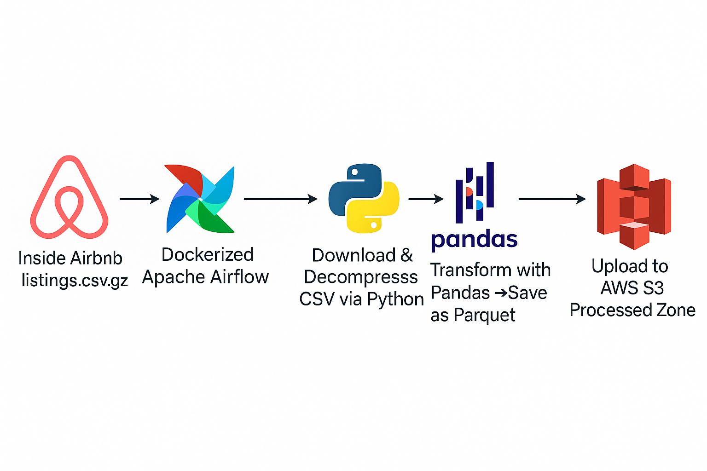

# Orchestrated Airbnb Data ETL Pipeline: Airflow & AWS S3 🏙️☁️

**An automated ETL pipeline using Apache Airflow to ingest, transform Airbnb listing data, and load it into Amazon S3.**

This project demonstrates a robust, production-minded approach to data engineering, showcasing workflow orchestration, cloud integration, data processing with Pandas, and best practices like configuration management and logging.

## 🌟 Key Achievements & Skills Demonstrated

*   **Workflow Orchestration (Apache Airflow):**
    *   Designed and implemented a multi-step DAG.
    *   Utilized `PythonOperator` for custom task logic.
    *   Managed task dependencies and inter-task data passing via XComs.
    *   Ran Airflow locally using Docker and Docker Compose.
*   **Cloud Integration (AWS):**
    *   Uploaded processed data to **Amazon S3** using Boto3.
    *   Managed AWS credentials securely for Airflow task execution.
*   **Data Ingestion & Processing (Python & Pandas):**
    *   Fetched data from an external web source (Inside Airbnb).
    *   Handled `.gz` file decompression.
    *   Performed comprehensive data cleaning and transformations:
        *   Type conversions (price to numeric, dates to datetime).
        *   Missing value imputation.
        *   Feature selection and structuring.
    *   Output data to the optimized **Apache Parquet** format.

## ⚙️ Pipeline Workflow & Architecture

The pipeline, orchestrated by Airflow, executes the following tasks sequentially:

1.  **Download & Decompress Raw Data:**
    *   Fetches `listings.csv.gz` for NYC from Inside Airbnb.
    *   Saves and decompresses it to a raw `.csv` file in a local staging area (accessible to Airflow workers).
    *   Passes file paths via XComs.
2.  **Transform Data:**
    *   Reads the raw CSV into a Pandas DataFrame.
    *   Applies cleaning and transformation logic.
    *   Saves the transformed DataFrame as a Parquet file in the local staging area.
    *   Passes the Parquet file path via XComs.
3.  **Upload Processed Data to S3:**
    *   Reads the processed Parquet file path from XComs.
    *   Uploads the Parquet file to a designated "processed" zone in Amazon S3.
    *   S3 object keys include the execution date for versioning.

### Airflow DAG Visualization

## 🛠️ Tech Stack

*   **Orchestration:** Apache Airflow
*   **Containerization:** Docker
*   **Cloud:** Amazon Web Services (AWS S3, IAM)
*   **Language:** Python 3.x
*   **Libraries:** `apache-airflow`, `pandas`, `pyarrow`, `boto3`, `requests`, `python-dotenv`, `logging`
*   **Data Formats:** CSV, GZip, Apache Parquet

## 💡 Business Value & Use Case

This automated pipeline creates an analytics-ready dataset of Airbnb listings. This data can be used for:
*   Market trend analysis (pricing, popular neighborhoods).
*   Investment insights for short-term rentals.
*   Understanding listing features and their correlation with reviews/price.
The processed Parquet files in S3 are readily consumable by BI tools or further data science workflows.

## 👤 Contact

*   **Name:** Ramesh Manthirakumar
*   **LinkedIn:** https://www.linkedin.com/in/ramesh-manthirakumar-a49191199/